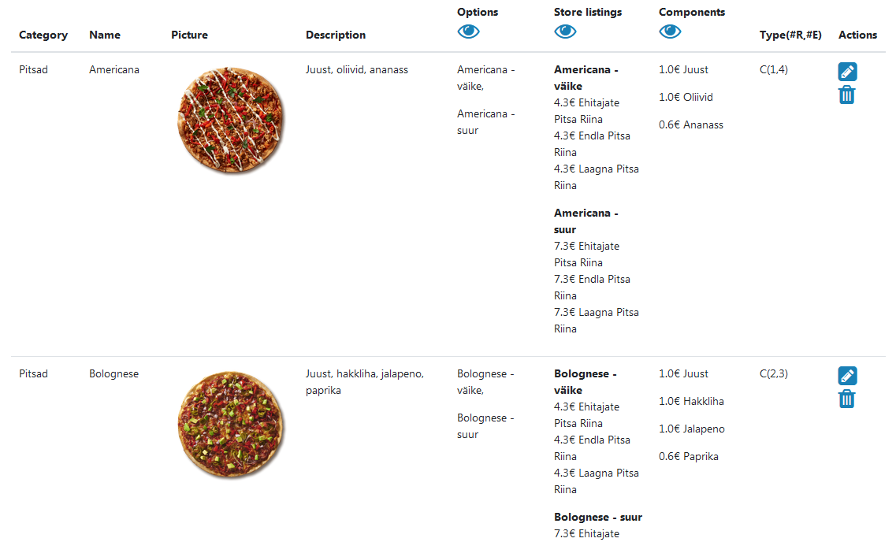
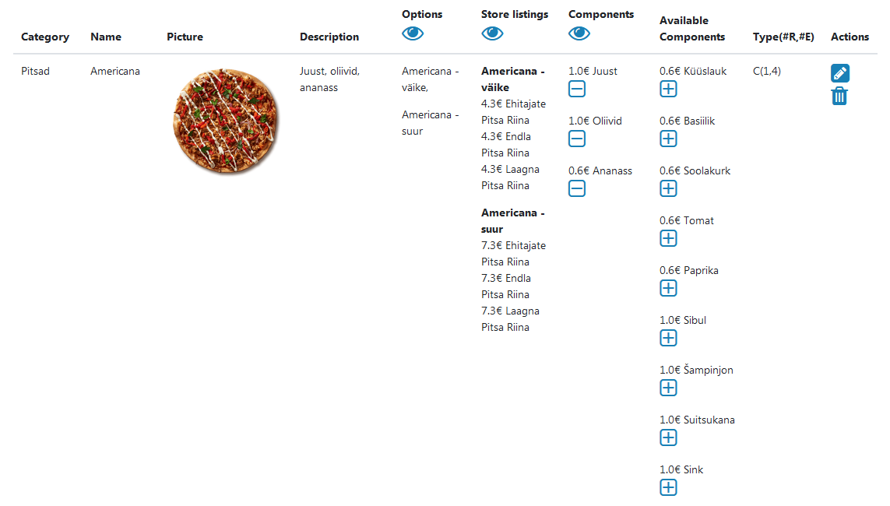
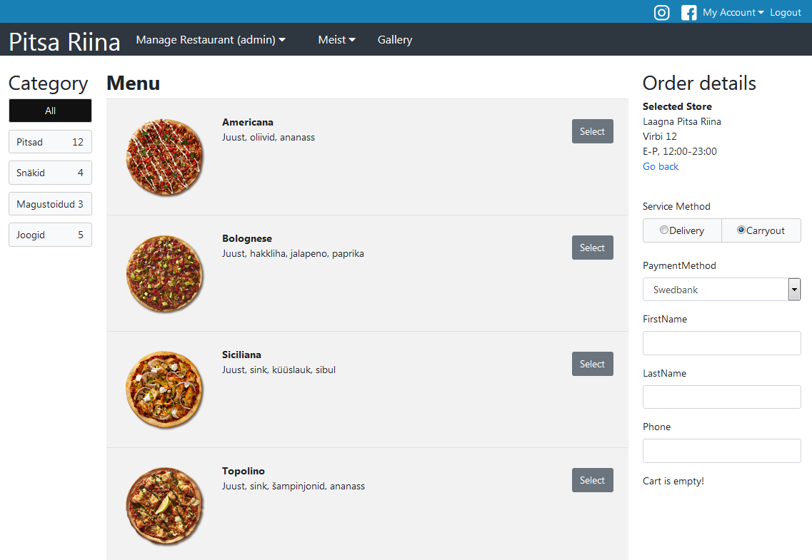
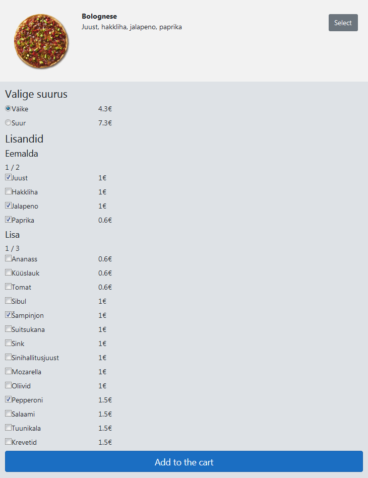

# Pitsa Riina

Distributed Systems (ICD0009) and Javascript (ICD0006) project.
Dotnet REST backend and Aurelia frontend single-page application for restaurant management (admin) and meal ordering (customer).

Food ordering system aimed at dynamic foods - customers can modify existing meal templates.
Includes a calculator to allow bill splitting for groups based on individual member's consumption.

## Demo

Admin can view or change items attributes and item prices at different restaurants.

Admin can add or remove components.

Item ordering page for selected restaurant has a list of all the items by category.
Purchases are stored under customer account.

User can choose food size and modify existing components 
(order big Bolognese pizza with mushrooms and pepperoni but remove minced meat.
One more original component can be removed and 2 more components can be added.)
Price depends on pizza base price plus extra components.

## Notes

Removed expired Azure deployment.
Switched back to local database.
